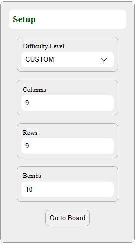
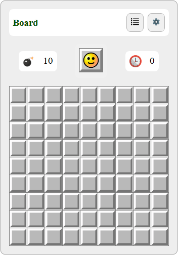

# **Minesweeper**

> Puzzle game with the aim of clear an abstract minefield without detonating a mine.
If a square containing a mine is revealed, the player loses the game.
Otherwise, a digit is revealed in the square, indicating the number of adjacent squares that contain mines.

## About the Project

<p align="center">
  
  
</p>

This is an Angular based app to build the famous [minesweeper](https://en.wikipedia.org/wiki/Minesweeper_(video_game)) puzzle game 

## **Technologies used for this project.**

[](https://html.spec.whatwg.org/multipage/)
[](https://www.css3.com/)
[](https://developer.mozilla.org/en-US/docs/Web/JavaScript)
[](https://www.typescriptlang.org/)
[](https://angular.io/)
[](https://sass-lang.com/)

### **How to start project**

## Install project dependecies:

```
npm install
```

## Start the web server

```
npm start
```
